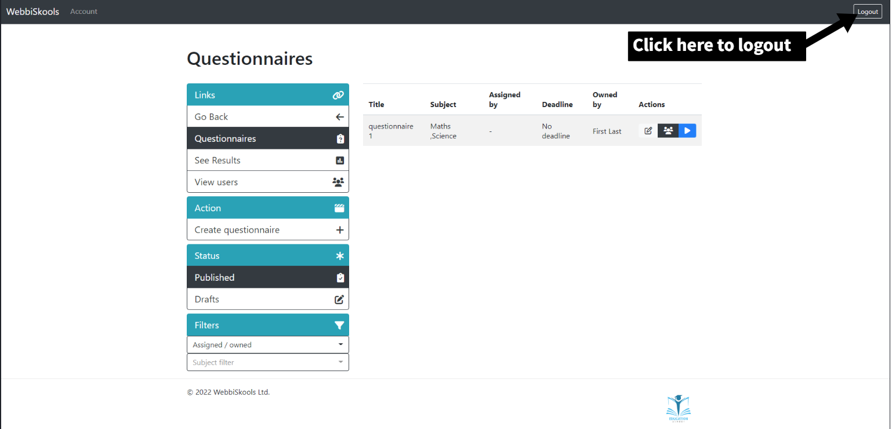
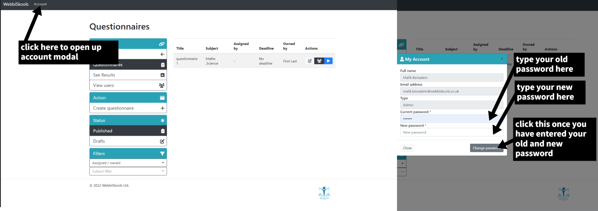
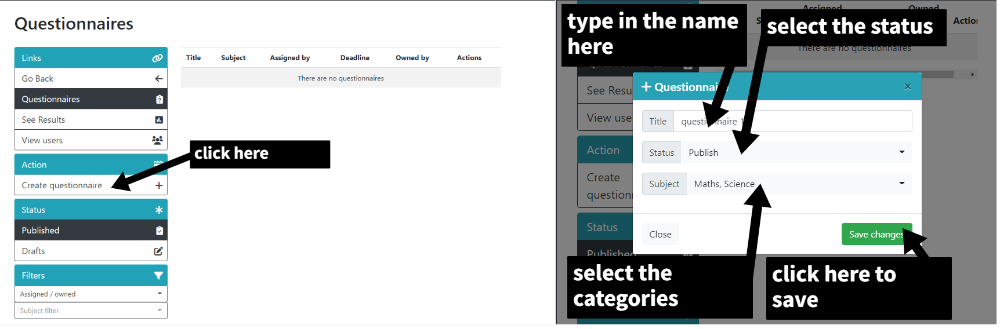
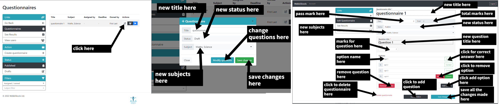
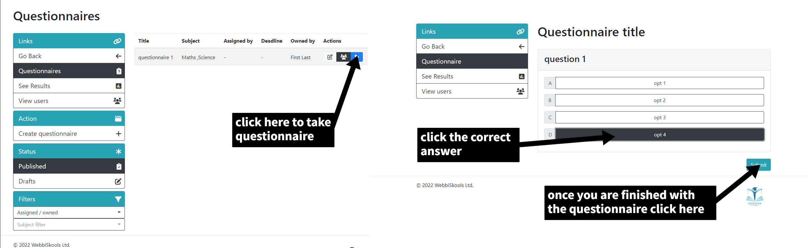
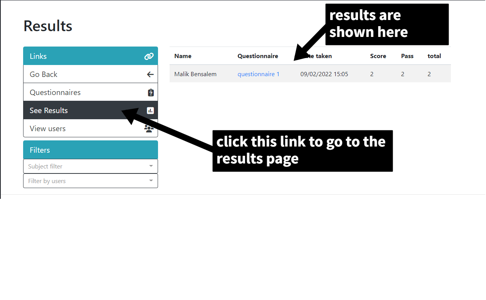
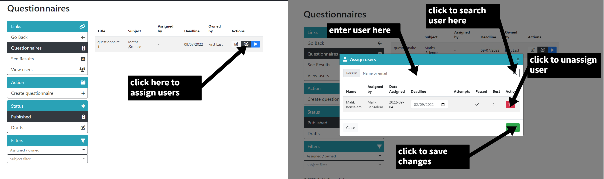
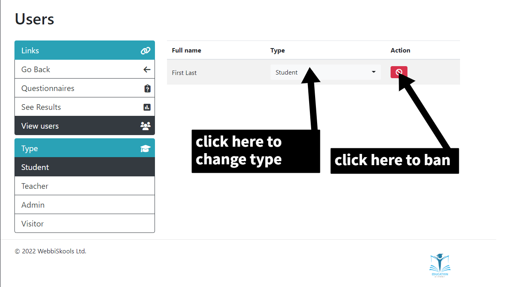

# Quiz master

WebbiSkools Ltd provides on-line educational solutions to commercial and government clients, such as universities and training departments of large industrial companies. This website enables the creation and management of questionnaires consisting of multiple-choice questions.

## Prerequisite

- You must have a local envirment or domain setup with Mysql
- Have PHP 8 or above and MySql 8 or above

## Installation

- Clone the Repository into your enviroment (https://github.com/malikbensalem/quiz-master.git)

## Setup

- Make sure PHP short tags are enabled
- import `/assets/sql/quiz_master.sql` to the database
- Set `$baseURL` to  domain (dbc.php)
- Set `DB_HOST` to host (dbc.php)
- Set `DB_USER` to database username (dbc.php)
- set `DB_PASS` to database password (dbc.php)
- set `DB_NAME` to database name (dbc.php)
- set `PW_KEY` to secret password (dbc.php)
- set `PW_ENCRYPT` to secret password (dbc.php)
- set `ROOT_PATH` to root directory (.htaccess)

## How to use

Follow these steps to login / register:

Follow these steps to logout:

Follow these steps to change password:

Follow these steps to make a questionnaire:

Follow these steps to edit / delete / see correct answers for questionniare:

Follow these steps to take questionniare:

Follow these steps to see the results of users:

Follow these steps to see / modify assign questionniare:

Follow these steps to see / modify users permissions:

